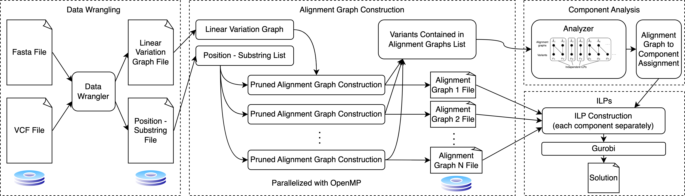

## Preserving Read Mappability with the Minimum Number of Variants

This repository is used to Preserving Read Mappability with the Minimum Number of Variants in genome variation graphs.
In other words, for a given complete variation graph of each chromosome, it creates a reduced variation graph in which 
some variants are removed subject to some constraints while preserving read mappability. The constraints are for every substring of length 
alpha observed in haplotypes, the reduced varaition graph guarantees to preserve those substrings with
at most delta errors (i.e., edit distance of delta among alpha-long substrings of haplotypes in complete variation graph with those of reduced variation graph).

## Dependencies
- gcc (with C++20 support)
- Boost Graph Library
- [samtools](https://vcftools.github.io/)
- [bcftools](https://samtools.github.io/bcftools/)
- [Gurobi](https://www.gurobi.com)
- [igraph](https://github.com/igraph/igraph)
- [OpenMP](https://curc.readthedocs.io/en/latest/programming/OpenMP-C.html)



## Installation
The above dependencies can be handled by running script `dependencies.sh`.

### To use Gurobi:
Get your free Gurobi academic license code by registering here: https://www.gurobi.com/downloads/end-user-license-agreement-academic"
Add your licence key by using build/gurobi910/linux64/bin/grbgetkey tool"

The overall workflow is:

```sh
git clone https://github.com/NedaTavakoli/hged_cpp
cd hged
project_dir=$(pwd)          # project top-level directory
chr_id=22                   #* change this numbers according to your needs
# download data and softwares
chmod +x dependencies.sh
./dependencies.sh ${chr_id} 
make
cd build
```

After a successful compilation, expect executables named as `main_ilp` and `data_wrangler` in a directory named `build`.

## Usage
All the executables implement a variety of algorithms to achieve variant graph size reduction, but they all have a similar interface.
```
SYNOPSIS
      
        data_wrangler  -a <alpha> -d <delta>  -chr <id> -vcf <file1>  -fa <file2> 
        main_ilp  <file2> <file3> <graph_dir> <ILP_dir> <alpha> <delta> <I/O> 

OPTIONS
        <alpha>        path length in variation graph (e.g., 500)
        <delta>        differences allowed (e.g., 10)
        <id>           chromosome id (e.g., 22), make it consistent with vcf file
        <file1>        compressed vcf file (something.vcf.gz)
        <file2>        reference genome fasta file (something.fa)
        <file3>        linear variation graph file for SNPs and INDELs (something.txt)
        <file4>        positon haplotype substrings file (something.txt)
        <graph_dir>    directory to save graph files (use mkdir graph_dir)
        <ILP_dir>      directory to save ILP files (use mkdir ILP_dir)
        <I/O>          A binary number represent to save graph and ILPs on disk (0: don't save or 1: save)

```

The project has the following folder structure:
```
hged
|___src  
    |___data_wrangler.cpp           # to construct <file1> and <file2>
    |___main.cpp                    # code to construct ILPs and solve the problem
...
```

The algorithm has the following steps:
```
1- Loading data: 
    Inputs: edges_file_name, location_substring_file_name
    outputs: E, locations, substrings, num_variants

2- Cosntruct graph  
    Inputs: E
    Outputs: G

3- Create global ILP
    Inputs: G, locations, substrings, number_variants, alpha, delta
    Outputs: model  

        |___Create global ILP 
        |   |___G_ind = reachable_subgraph(G, pos, alpha + delta)              # Find the reachable subgraph of distance d from a pos
        |   |___G_a, start_v, end_v = create_alignment_graph(G_ind, pos, S)     # igonre source, pos is the top-left vertex
        |   |___G_a_pruned = prune_alignment_graph(G_a, start_v, end_v, delta) 
        |   |___|___G_no_dup = remove_multiedges(G) # remove multi-edges keeping the ones with the lowest weight, sort edges and remove duplicates with largest wei
        |   |___model = create_sub_ILP(model, G_a_pruned, start_v, end_v, delta, index_offset, global_var)  # create sub ILPS
 ```     
  


